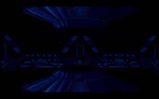
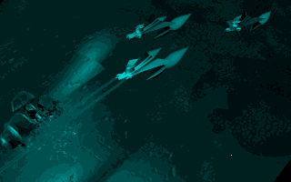
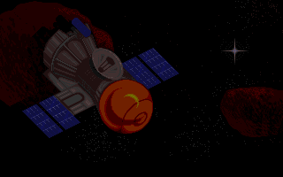
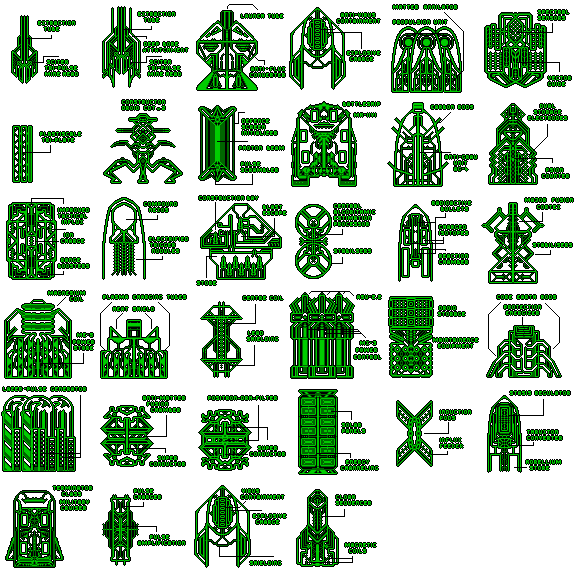
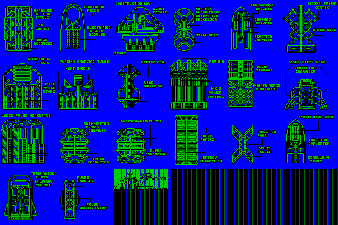

The following images are extracted from all compressed .MGL files on the disk
which contain image data. All are either IFF ILBM format full-screen images at
320 x 200 pixels, or Amiga sprite data. They have been converted to PNG or GIF
for display here. The original IFF versions of the IFF files can be found in the
[images_iff](https://github.com/tetracorp/k240/tree/master/data/images_iff)
directory.

The only MGL files not included here are english.mgl, french.mgl, and
german.mgl, which contain arrays of the translated game text; and the "speech"
directory, which contains voice audio.

### alienp1.mgl

Alien 6 (Swixaran) race picture used on alien select screen. Note how the race
picture numbers do not match up with the usual numbering for the aliens. The
planet image numbers also do not match up.

### alienp2.mgl

Alien 3 (Ax'Zilanth) race picture used on alien select screen.

### alienp3.mgl

Alien 2 (Ore Eater) race picture used on alien select screen.

### alienp4.mgl

Alien 5 (Rigellian) race picture used on alien select screen.

### alienp5.mgl

Alien 1 (Kll-Kp-Qua) race picture used on alien select screen.

### alienp6.mgl

Alien 4 (Tylaran) race picture used on alien select screen.

### demo.mgl

Intro screen exclusive to the CU Amiga K240 demo.

### demo2.mgl

Outro screen exclusive to the CU Amiga K240 demo.

### hologram.mgl

Background to the alien select screen. The filename implies that the alien
planet visible in the background is being projected as a hologram.

### lang.mgl

Language select screen: English, Francais, Deutsche. These should properly be
spelled Français and Deutsch.

### outro1.mgl

Win screen. Graphic displayed when the player defeats an alien.

### outro2.mgl

Lose screen. Graphic displayed when the player is defeated.
The object on the left is an Orbital Space Dock.

### outro3.mgl

Unused win screen intended to be displayed when the player defeats the
Swixarans, which has its own win text. Analysis of the game code shows that
winning against the Swixarans has its own separate outro, but the game's final
release simply gives the filename of outro1.mgl as its image. Outro3 may have
been omitted due to memory constraints or technical difficulties. A screenshot
in The One Amiga magazine, almost certainly from a pre-release review copy,
shows satpic.mgl on the Swixaran win screen instead.

### planet1.mgl

Planet graphic for alien 3 (Ax'Zilanths).

### planet2.mgl

Planet graphic for alien 6 (Swixaran).

### planet3.mgl

Planet graphic for alien 1 (Kll-Kp-Qua).

### planet4.mgl

Planet graphic for alien 5 (Rigellian).

### planet5.mgl

Planet graphic for alien 2 (Ore Eaters).

### planet6.mgl

Planet graphic for alien 4 (Tylarans).

### satpic.mgl

Background image to the Intel screen.

### scitek.mgl

Background image to the Sci-Tek blueprint purchase screen.

### scitek.mgl (demo)

Background image to the Intel screen. This variant, used in the CU Amiga demo,
is slightly brighter. The final version was likely reduced in brightness to
improve readability.

### shop1.mgl - shop6.mgl

A combined image showing shop1.mgl, shop2.mgl, shop3.mgl, shop4.mgl, shop5.mgl,
and shop6.mgl, which contain sprite data. They display blueprints as shown on
the Sci-Tek purchase screen. The load times seen while browsing the blueprints
screen are due to loading the next of the six files. Each row of six blueprints
here is one of the files.

### shop3.mgl - shop6.mgl (old versions)

A slightly different version of the shop files on the disk of the CU Amiga K240
demo, read from the disk using DiskSalv. They are likely from an earlier build
of the game. The corruption on the bottom-right is due to missing data. The only
notable difference here is that some of the images are moved around a few pixels
from their final position. Additionally, though it is not visible in this image,
the sprites use different palette numbers.

### tetra.mgl

Background to the new game screen.

### wireplan.mgl

Wireframes for the eight ships as displayed on the Construction Yard or Orbital
Space Dock build screen. Sprite data. Wireframes are the same in the CU Amiga
K240 demo.

## Notes

IFF files were converted to PNG/GIF using Imagemagick. The sprite images were
converted using the following script:

    convert planet1.png -crop 64x53 +repage planet1-%03d.png
    convert -delay 13 -loop 0 -dispose 2 planet1-0*.png planet1.gif
    rm planet1-0*.png

Amiga sprites were extracted using
[Maptapper](https://codetapper.com/amiga/maptapper/). Extracting all of the
sprites from the game using this tool has proven challenging.

MGL files were extracted using
[Denormalize](https://radishengine.github.io/denormalize/), a web-based
extractor for a later Gremlin Interactive game, using the following kludgy
method:

1. With the Inspector open, upload an MGL file.
2. Right-click the "Blob" which appears in the Inspector and store it as a
   global variable
3. Add a download instruction; e.g. temp1.download("scitek.mgl").

At current, I do not know of any method to re-pack an MGL file, although such a
thing would be interesting for the purpose of modding the game.
